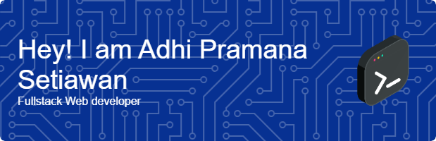

Welcome to my personal portfolio repository!  
I’m a passionate Web Developer with a strong foundation in Web 2.0 technologies and a growing enthusiasm for the world of Web 3.0. I specialize in building responsive, user-friendly websites using HTML, CSS, PHP, and JavaScript

Currently, I’m expanding my skills into decentralized technologies, exploring smart contracts, blockchain development, and how Web3 can shape the future of the internet. I enjoy learning, experimenting, and staying at the forefront of digital innovation.

Whether it's crafting clean UI/UX experiences or diving into decentralized apps (dApps), I'm excited to bridge the gap between traditional web development and the decentralized web.

---

### 💼 Experience

#### 🌐 Web Developer Intern — PT. Mitratech Indonesia  
*Jun 2023 – Nov 2023*  
- Developed a Web-based office car usage recapitulation application using native PHP and MySQL as a database, making it easier to manage the company's operational data. 
- Collaborate actively with the team in software development, including planning, testing, and implementing new features.  
- Use development tools such as GIT for version control, and learn and understand the use of frameworks commonly used in the industry. 

---

### 🛠️ Skills

 

<!-- ---

## 📁 Featured Projects

| Project Name             | Description                                                  | Tech Stack               |
|--------------------------|--------------------------------------------------------------|--------------------------|
| [Portfolio Website](#)   | A personal site showcasing my skills, projects, and contact  | HTML, CSS, JS            |
| [To-Do App](#)           | A simple task management app with CRUD functionality         | Laravel, Bootstrap       |
| [Local Business Site](#) | Landing page for a small business to promote their services  | Tailwind, JavaScript     |

Explore all projects in the `/portfolio` folder. -->

<!-- ---

## ✍️ Articles & Writings

I occasionally write about productivity, personal growth, and beginner tech tips.

- [3 Productive Habits for Students](blog/productivity-tips.md)  
- [Saving Tips for Beginners](blog/financial-habits.md)  
- [Time Management with the Pomodoro Technique](blog/time-management.md)

All articles are available in the `/blog` folder. -->

<!-- ---

### 📄 Resume

You can find my resume [here](./resume.pdf) or in the root directory of this repository. -->

---

### 📬 Get in Touch

- **Instagram:** [@adhi.prm](https://instagram.com/adhi.prm)  
- **Email:** [adhiprm22@gmail.com](mailto:adhiprm22@gmail.com)

Feel free to reach out for collaboration, job opportunities, or just to say hello! 😊

---

> “Code is like humor. When you have to explain it, it’s bad.”  
> — *Cory House*
